RECRUİT

Recruit has just launched its new recruitment portal, allowing HR staff to manage candidate applications and administrators to oversee hiring decisions. While the platform appears functional, management suspects that security may have been overlooked during development. Your task is to assess the application like a real attacker, mapping its structure, abusing exposed functionality, and exploiting vulnerabilities.

Can you gain an initial foothold, escalate your access, and ultimately log in as the administrator?

Our first task is to use Nmap.
nmap -p- -A -sS 10.113.165.77 
As you can see, ports 22/tcp, 53/tcp, and 80/tcp are open.

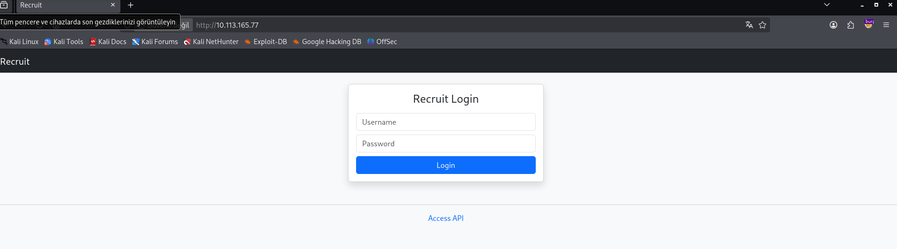
Let’s visit the website. Let’s take a look at the Account API at the bottom of the page.

The Account API exposes a filLet’s keep this here and return to the terminal.
Here, it gives us an API. Let’s keep this here and return to the terminal.

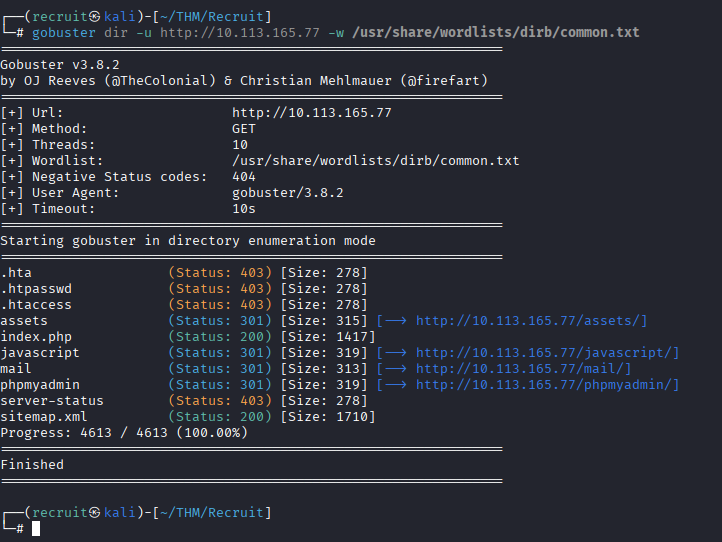
I’m running Gobuster.
gobuster -dir -u hhtp://10.113.165.77 -w /usr/share/wordlists/dirb/common.txt
Let’s visit the /mail endpoint.

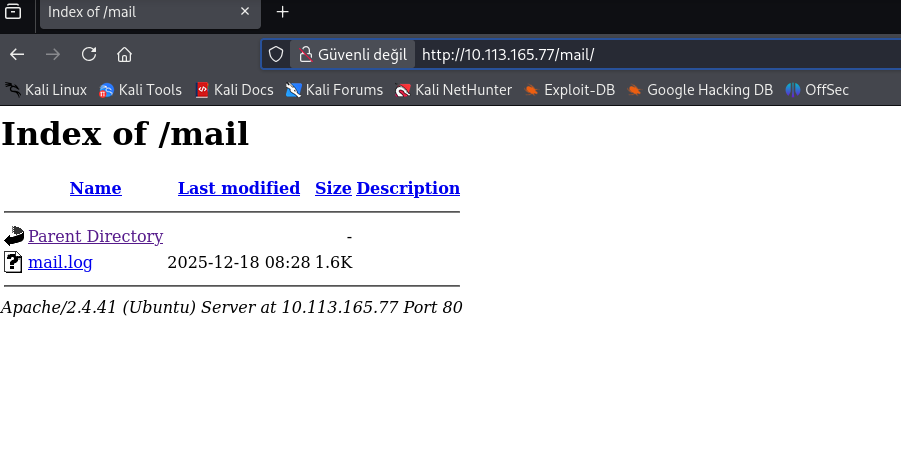
Let’s take a look at mail.log.

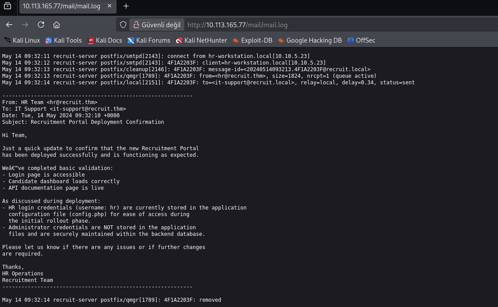
As discussed during deployment:
- HR login credentials (username: hr) are currently stored in the application
  configuration file (config.php) for ease of access during
  the initial rollout phase.
- Administrator credentials are NOT stored in the application
  files and are securely maintained within the backend database.
  Here, we can see the username: `hr`.
Next, we have config.php. We’ll try to access config.html using the `file.php?cv=<URL>` endpoint it gave us. Let’s go back to the website.

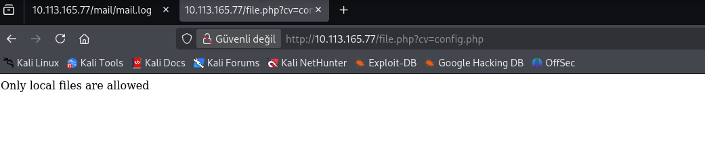
We got an "Only local files are allowed" error.
In PHP, there is a URL scheme called file://. It is used to read local files on the server.
Let’s try to read the file this way. (For more information on this topic, see: LFI (Local File Inclusion) and SSRF.)

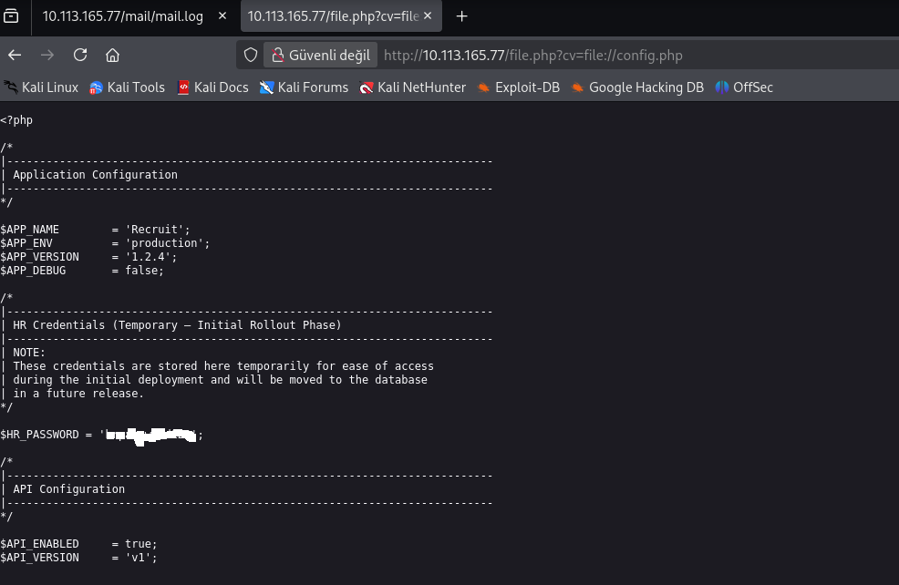
We can see the `hr` user's password where it says `HR_PASSWORD=`. 
Now that we have the password, we can log in.

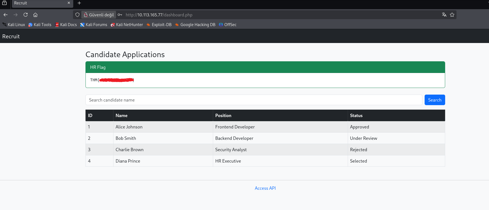
We successfully logged in and got our first flag.
As you can see, there is a search button and a table containing IDs. 
Naturally, the first thing that comes to mind is SQL injection. Let’s try to break the table.

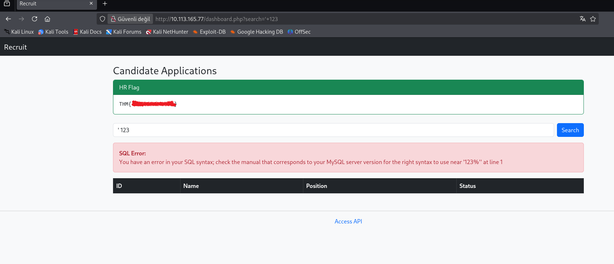
First, I’m starting Burp Suite and turning **Intercept** on. 
Then, I enter `'123` in the search field on the website and get the error shown on the screen.
The user input is directly inserted into the SQL query, and the application reflects the SQL syntax error back to us.
Let’s go to Burp Suite.

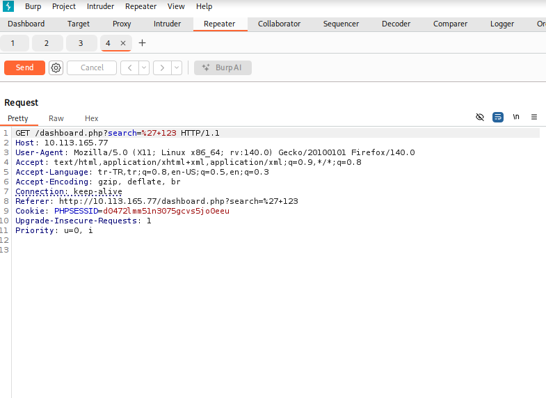
I intercept the request in Burp Suite and send it to Repeater. 
Then, I right-click and select **Save item** to save the output.

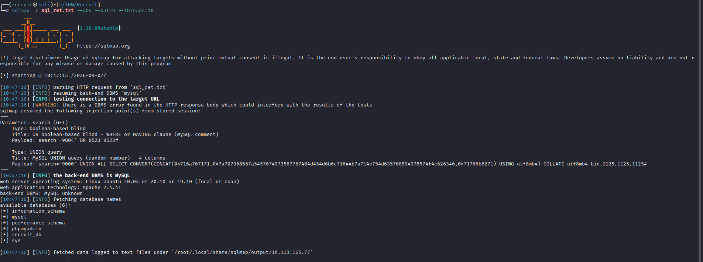
I’m running SQLMap.
sqlmap -r sql_ret.txt -dbs --batch --threads=10
-r sql_ret.txt → Reads the HTTP request from the sql_ret.txt file.
--dbs → Lists the names of the databases that can be detected on the target.
--batch → Automatically selects the default answers for the prompts.
--threads=10 → Attempts to run the operations using 10 parallel threads.
In the results, I found `recruit_db`, so I turned my attention to it.

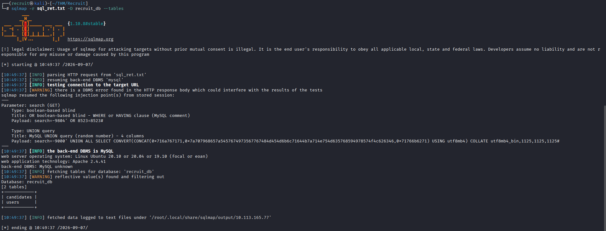
sqlmap -r sql_ret.txt -D recruit_db --tables
-D recruit_db --tables → Lists the tables in the selected database.(If you want to find the columns, use --columns.)
I can see the `users` table. Let’s retrieve the information inside it.

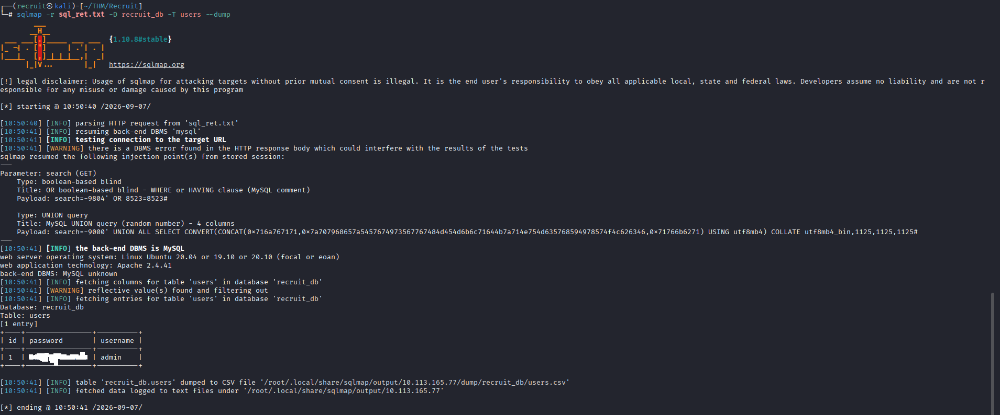
sqlmap -r sql_ret.txt -D recruit_db -T users --dump
`--dump` → Retrieves the data.
As you can see, it gave us the admin user's password. 
Now, let’s go to the website, log in as admin, and get our second flag.

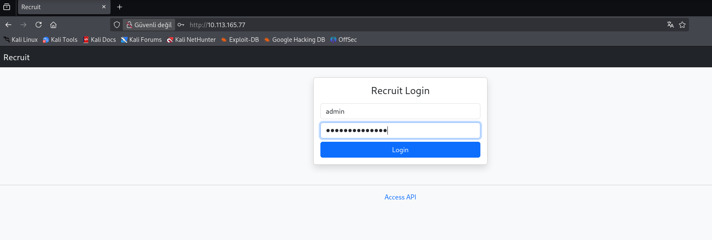
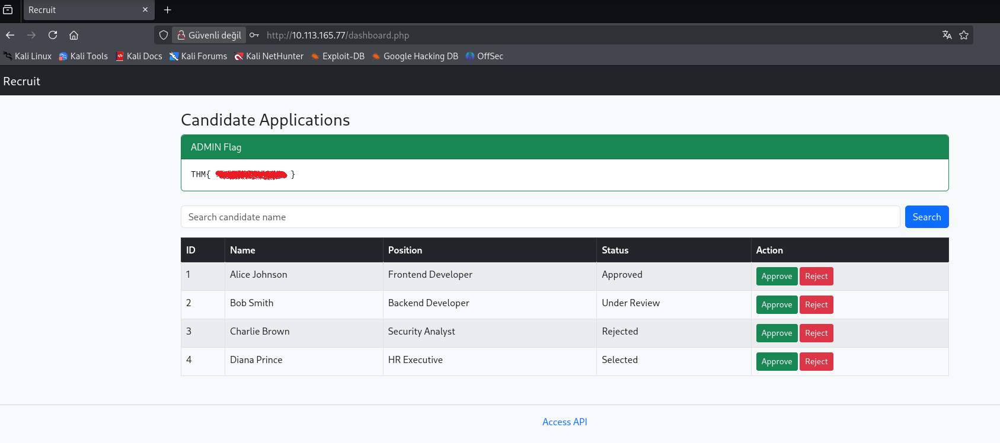
We got our second flag as well.

Congratulations to everyone who made it this far.

